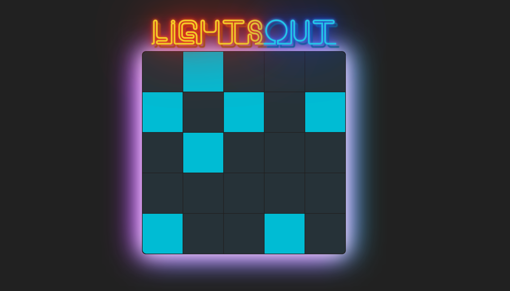
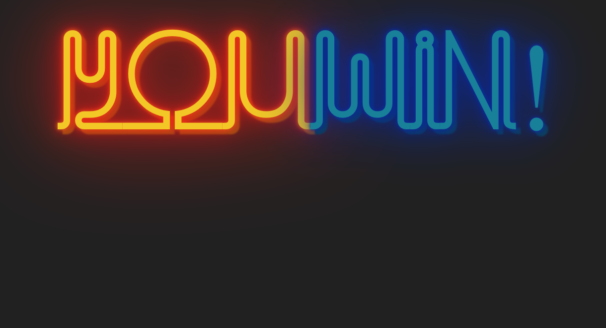

# Lights Out!
Lights out is a classic game which consists of a 5 by 5 grid of lights. When the game starts, a random number or a stored pattern of these lights is switched on. Pressing any of the lights will toggle it and the adjacent lights. The goal of the puzzle is to switch all the lights off, preferably in as few button presses as possible.

**This game was built using the starter code given in Colt Steele's online React course.**

## Screenshots

**Board:**

**Winner:**
